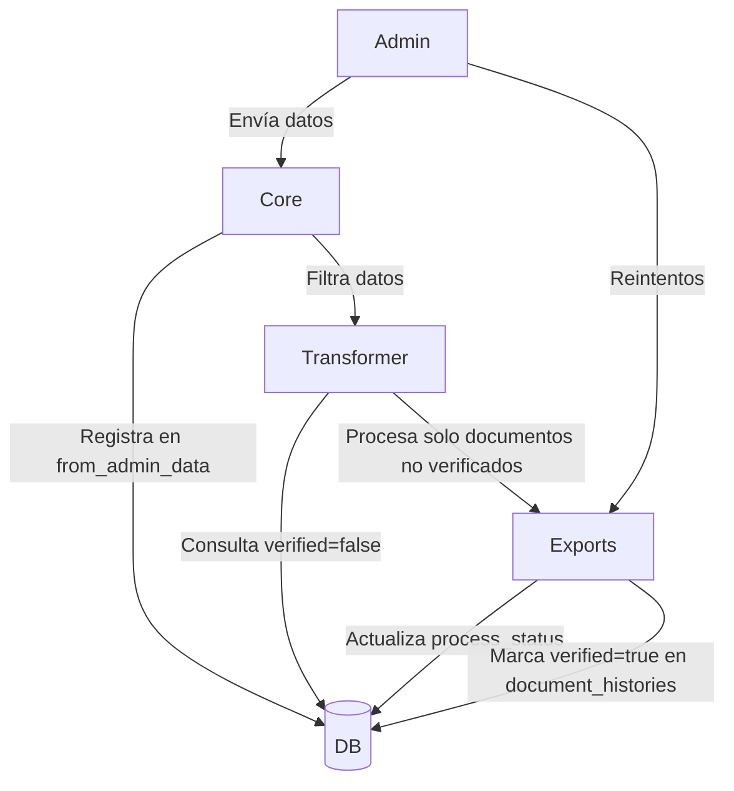

# Sistema de Validación de Documentos - Especificación Técnica

## Flujo de procesamiento

```text
A (Admin) → C (Core) → T (Transformer) → E (Exports)
```

## Tabla: document_validation_history

```text
Columns:
- id INT PRIMARY KEY
- from_admin_data JSON      /* Datos crudos recibidos de Admin */
- to_transformer_data JSON  /* Datos filtrados enviados a Transformer */
- from_transformer_data JSON /* Respuesta procesada de Transformer */
- process_status STRING      /* Estados (ver al final del MD) */
- retry_counter INT          /* Contador de reintentos */
```

## Secuencia de operaciones

### En API Core (C)

- Recibe payload de Admin (A)
- Registra `from_admin_data` con los datos originales
- Filtra y transforma los datos
- Actualiza `to_transformer_data` con los datos filtrados
- Envía a Transformer (T)

### En API Exports (E)

- Recibe respuesta de Transformer (T)
- Actualiza `from_transformer_data` con la respuesta
- Si el procesamiento es exitoso:
  - Envía email → marca `process_status = SENT`
  - Actualiza `document_histories.verified = TRUE` para el documento relacionado

## Diagrama de Flujo Principal



## Estructura de Base de Datos

```sql
CREATE TABLE document_validation_history (
    id SERIAL PRIMARY KEY,
    from_admin_data JSON,
    to_transformer_data JSON,
    from_transformer_data JSON,
    process_status STRING DEFAULT EMPTY,
    retry_counter NUMBER DEFAULT 0
);
```

### Modificación en Tabla Existente

```sql
ALTER TABLE document_histories 
ADD COLUMN patent_verified BOOLEAN DEFAULT FALSE;
```

### Relaciones clave

- Cada registro en `document_validation_history` está relacionado con muchos documentos de la tabla `document_histories`
- El campo `process_status` solo se pone COMPLETADO si toda la cadena de procesamiento finaliza exitosamente

### Notas de implementación

- Todas las transiciones entre servicios deben registrar su payload correspondiente
- El estado CORRECTO de email es persistido solo después de confirmación de envío
- La verificación final depende del éxito en todas las etapas anteriores

## Otros Endpoints

> El objetivo final es poder ampliar la gama de posibilidades al mostrar y reejecutar acciones, sin perder la trazabilidad del proceso completo y conocer individualmente qué sucede con cada documento.

### Nuevo EP en Exports

```http
POST /api/retry-failed-emails
Content-Type: application/json

{
  "validation_histories_id": 30
}
```

#### Mecanismo

1. Consulta `from_transformer_data` usando los IDs proporcionados
2. Valida que este se encuentre en el estado específico de email fallido
3. Arma el Excel
4. Reenvía emails solo para registros con:
   - `process_status= SENT_ERROR`

5. Actualiza solo:

```sql
UPDATE document_validation_history 
SET process_status = SENT 
WHERE document_id IN (...)
```

---

### Nuevo EP en Core API para Consulta

```http
GET /api/last-validation-histories
Content-Type: application/json
{
  "id": 30,
  "from_admin_data": {},
  "to_transformer_data": {},
  "from_transformer_data": {},
  "process_status": "",
  "retry_counter": 0,
}
```

Este EP es importante para acceder a `process_status` y saber en qué estado está. De esta manera se puede permitir al usuario mostrar el estado de procesamiento y poder hacer acciones en función de esto.


### Nuevo EP en Core API para Reintentos

```http
POST /api/retry-failed-docs
Content-Type: application/json

{
  "validation_histories_id": 30
}
```

Este EP toma los datos ya filtrados en caso de que pueda, sino, intenta nuevamente filtrarlos tomando los datos de filtros originales (ver columna `from_admin_data`)

### Descarga de Excel

```http
GET /api/download-validation-history-excel
Content-Type: application/json

{
  "validation_histories_id": 30
}
```

Este EP solicita descargar nuevamente los datos de documentos ya filtrados y procesados, a fin de ver el estado en el que están actualmente. Consulta los datos de la tabla `document_validation_history` columna `from_transformer_data`, arma el Excel y lo responde en el EP. Así desde el Admin podrán descargarlo.

## Información Importante

El campo `process_status` en la tabla `document_validation_history` corresponde a un enum:

```javascript
PROCESS_STATUS = {
    // Estados normales
    EMPTY: 'EMPTY',         // Por defecto
    FILTERED: 'FILTERED',   // Si la solicitud de filtrado es exitosa
    PENDING: 'PENDING',     // Si se ha enviado correctamente al transformer
    VERIFIED: 'VERIFIED',   // Si el proceso de verificado se completó correctamente
    SENT: 'SENT',           // Si el email se ha enviado correctamente
    
    // Estados de error
    FILTERED_ERROR: 'FILTERED_ERROR',   // Si el filtrado falló
    PENDING_ERROR: 'PENDING_ERROR',     // Si el envío al transformer falló
    VERIFIED_ERROR: 'VERIFIED_ERROR',   // Si el proceso de verificación falló
    SENT_ERROR: 'SENT_ERROR',           // Si el envío de email falló
}

